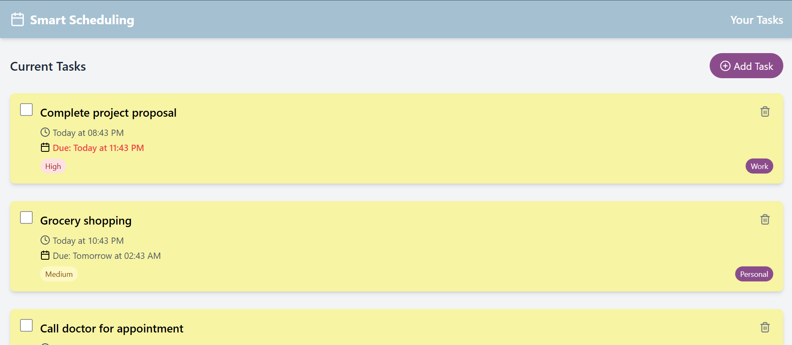
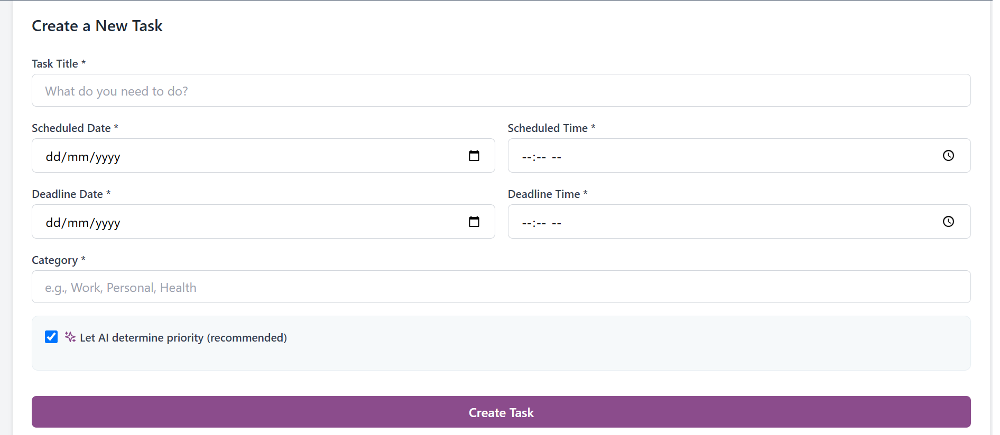

<!-- 

      <h1>  Smart Scheduling </h1>
     
 -->

# Description
This app is a prototype for our Software Engineering class. **Smart Scheduling** is an AI-powered task management app that intelligently organizes, prioritizes, and schedules your daily activities. By analyzing your workload, deadlines, and preferences, it creates an optimized plan to help you stay focused and productive—without the stress of manual planning. With a clean, intuitive interface and pastel-themed visuals, Smart Scheduling brings clarity and calm to your day.

# Features
- 🧠 AI-Powered Task Prioritization
- ⏰ Auto-Scheduling
- 👥 Collaborative Scheduling
- 🔔 Smart Reminders & Notifications
- 🏆 Point-Based Rewarding System

[Try it yourself!](https://prismatic-hotteok-c2aeee.netlify.app/)

# Screenshots

# Tech Used
      
      
 

      
<!-- </> with 💛 by readMD (https://readmd.itsvg.in) -->
    